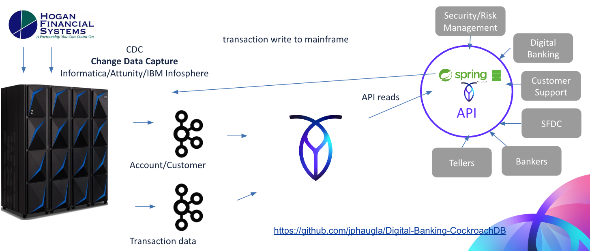
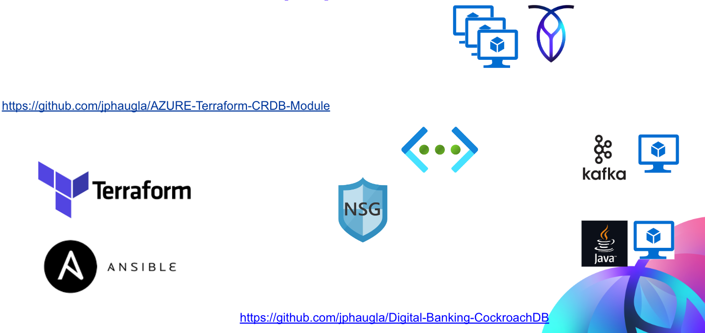

# Digital-Banking-CockroachDB

Provides a quick-start example of using CockroachDB and springBoot with Banking structures.  
Digital Banking uses an API microservices approach to enable high speed requests for account, customer and transaction 
information.  As seen below, this data is useful for a variety of business purposes in the bank.
<a href="" rel="Digital Banking"></a>

## Overview
In this tutorial, a java spring boot application is run through a jar file to support typical API calls to a 
CockroachDB banking data layer.  A CockroachDB docker configuration is included.

## CockroachDB Advantages for Digital Banking
 * CockroachDB easily handles high write transaction volume
 * CockroachDB Enterprise scales vertically (large nodes)  and horizontally (many nodes) in a distributed manner
 * CockroachDB is wire compatible with PostgreSQL for easy/familiar development
 * CockroachDB has SQL compatible and performant indexing capabilities lacking in noSQL tools
 * CockroachDB can do upgrades and schema modifications without downtime (RTO and RPO of zero)
 * CockroachDB integrates easily with Kafka and Spring JPA

## Requirements
* Docker installed on your local system, see [Docker Installation Instructions](https://docs.docker.com/engine/installation/).
* Alternatively, can run CockroachDB Enterprise and set the CockroachDB host and port in the application.properties file
* When using Docker for Mac or Docker for Windows, the default resources allocated to the linux VM running docker are 2GB RAM and 2 CPU's. Make sure to adjust these resources to meet the resource requirements for the containers you will be running. More information can be found here on adjusting the resources allocated to docker.
* NOTE:  seemed very difficult to change the swagger ui port from 8080 so left application and swagger ui port at 8080
  * this conflicts with typcial port 8080 configuration of CockroachDB http port of 8080-must change out port 8080 
[Docker for mac](https://docs.docker.com/docker-for-mac/#advanced)
[Docker for windows](https://docs.docker.com/docker-for-windows/#advanced)

## Links that help!

 * [Spring Data for Kafka](https://www.baeldung.com/spring-kafka)
 * [spring data Reference in domain](https://github.com/spring-projects/spring-data-examples/blob/master/CockroachDB/repositories/src/main/java/example/springdata/CockroachDB/repositories/Person.java)
 * [spring async tips](https://dzone.com/articles/effective-advice-on-spring-async-part-1)
 * [swagger-ui with spring](https://www.baeldung.com/spring-rest-openapi-documentation)
 * [Spring Data JPA](https://spring.io/projects/spring-data-jpa/)
 * [Spring Boot PostgreSQL CRUD example](https://www.javaguides.net/2021/08/spring-boot-postgresql-crud-example.htmlhttps://www.javaguides.net/2021/08/spring-boot-postgresql-crud-example.html)
 * [Spring Boot PostgreSQL CRUD github](https://github.com/RameshMF/spring-boot-tutorial-course/tree/main/springboot-backend)
 * [Cockroachlabs University sample movr application](https://university.cockroachlabs.com/courses/course-v1:crl+fundamentals-of-crdb-for-java-devs+self-paced/course/)


## Technical Overview

This github java code uses [Spring Data JPA](https://spring.io/projects/spring-data-jpa/) using the Java Persistence API repositories.  The jedis library supports RediSearch, CockroachDBJSON, and CockroachDBTimeSeries.  The original github only used spring java without CockroachDBearch.  That repository is still intact at [this github location](https://github.com/jphaugla/CockroachDB-Digital-Banking).  Another subsequent version uses crud repository and search at [this github location](https://github.com/jphaugla/CockroachDBearch-Digital-Banking)
All of the Spring Java indexes have been removed in this version.  The crud repository has been removed. 
### The spring java code
This is basic spring links
* [Spring CockroachDB](https://docs.spring.io/spring-data/data-CockroachDB/docs/current/reference/html/#CockroachDB.repositories.indexes) 
* *controller*-http API call interfaces.  Separate controller for each table api
* *data*-code to generate POC type of customer, account, and transaction code
* *domain*-has each of the java objects with their columns.  Enables all the getter/setter methods
* *exception*-exception handling code
* *repository*-has repository definitions.  Crud operations defined here as well as specific Query statements
* *service*-service layer for the controller to interact with the repository
* *util*-utility functions
### 
The java code demonstrates common API actions with the data layer in CockroachDB.  The java spring Boot framework 
minimizes the amount of code to build and maintain this solution.  Maven is used to build the java code and the code 
is deployed to the tomcat server.

### Data Structures in use
<a href="" rel="Tables Structures Used"></a>

## Using Docker for non-application components
This option uses docker to support all of the non-application components (kafka, CockroachDB) with the java application running on the local mac.
* Prepare Docker environment-see the Prerequisites section above...
* Pull this github into a directory
```bash
git clone https://github.com/jphaugla/CockroachDBearch-Digital-Banking.git
```
* Refer to the notes for CockroachDB Docker images used but don't get too bogged down as docker compose handles everything except for a few admin steps on tomcat.
 * [CockroachDB stack docker instructions](https://CockroachDB.io/docs/stack/get-started/install/docker/)
* Open terminal and change to the github home where you will see the docker-compose.yml file and bring up docker
* Add the jhaugland user name and give it full permissions
```bash
docker-compose -f docker-compose-kafka.yml -f docker-compose.yml up -d
cockroach sql --insecure 
> create user jhaugland;
> grant all on database defautldb to jhaugland;
```
## Deploying java application on local mac with Kafka non-application components
* ensure maven and java are deployed on the local machine
  * have been running with java 17 or java 18 but other versions should work as well
  * have been running with maven 14.2.1
* Set up the environment and run the java application locally
  * edit the [environment file](scripts/setEnv.sh) to use localhost for non-application components
  * source this environment file
  * run the application.  Note it will fail because jhaugland username is not 
```bash
source  scripts/setEnv.sh
java -jar target/cockroachDB-0.0.1-SNAPSHOT.jar
```

## Using terraform on azure for all components
<a href="" rel="Deployment"></a>
* Use [this github](https://github.com/jphaugla/AZURE-Terraform-CRDB-Module)  to deploy all of the components (including the application)
* Check the [readme](https://github.com/jphaugla/AZURE-Terraform-CRDB-Module/README.md) for the details on deploying this github including the cloning the github and working with Azure.  Completely deploy the terraform github for all deployments.  This will also deploy [this github](https://github.com/jphaugla/CockroachDBearch-Digital-Banking-CockroachDBTemplate) inside the tester node.  The later application deployment instructions will be deployed within the tester node using ssh
* maven and java will be installed by the ansible jobs for the tester node
* the ip information is shared in a [temp directory](https://github.com/jphaugla/AZURE-Terraform-CRDB-Module/provisioners/temp) within the terraform/ansible repository.  Go to the files here to see private (internal) and public (external) kafka node, cassandra node and testinnode IP addresses.  The CockroachDB internal and external database connection dns names are also available.  These dns names will also give an internal and external CockroachDB enterprise node IP.
* log into the tester node using the testernode IP and the ssh key defined in test/main.tf and go to github home
```bash
ssh -i <azure key> adminuser@<testerIP>
cd Digital-Banking-CockroachDB
```
* edit the [environment file](scripts/setEnv.sh)  using only the internal connection addresses.  NOTE: kafka will only connect from local azure IP addresses and not any public IP addresses.  Using public and private Kafka addresses is possible but not configured currently
* These steps can all be done from client machine local browser using the kafka node public IP address and port 9021.  [http://172.172.133.201:9021/](http://172.172.133.201:9021/) From this home screen, pause the currently running connectors:  datagen-pageviews, cassanddra-sink, and CockroachDB-sink-json  using the Kafka Control Center.   This will just remove the noise of a second application running.  
* Consider cleaning  the CockroachDB (drop the pageviews table)
* CockroachDB tables will be created automatically by Spring Data JPA
* start the application after logging in to the testernode
```bash
ssh -i ~/.ssh/<sshkey> adminuser@<testernode public ip>
cd Digital-Banking-CockroachDB
mvn clean package
# edit scripts/setEnv.sh for current nodes - CockroachDB_HOST, CockroachDB_PORT, and KAFKA_HOST must all change to match current environment.  *IMPORTANT* only use private/internal IP addresses-DO NOT USE *localhost*.  Additional note, CockroachDB password is different in local docker version and in ansible created version-verify CockroachDB password!
source scripts/setEnv.sh
java -jar target/cockroachDB-0.0.1-SNAPSHOT.jar
```
* get a second terminal window to the tester node and write a test message to kafka-this will cause the topic to be created.  Name can be changed in [application.properties](src/main/resources/application.properites) but default topic name is *transactions*
```bash
ssh -i ~/.ssh/<sshkey> adminuser@<testernode public ip>
cd Digital-Banking-CockroachDB/scripts
# make sure saveTransaction script says doKafka=true
./saveTransaction.sh
```
* verify transactions topic is created using kafka control center
  * in control center click on topics and then on the topics page, click messages
  * if you run saveTransaction.sh again while looking at the control center topic pane, the message will be visible.  If you put offset of 0, both messages will be visible.
  * application will create the kafka topic on first usage of the topic.  
* Call kafka API to create the CockroachDBSink using provided script.  DO THIS FROM your local Mac
```bash
cd Digital-Banking-CockroachDB/scripts
#  change localhost to the external/public ip address for the kafka node in the last line. 
#  Make sure this is the public kafka IP and not the private  
#  Verify the CockroachDB.uri and CockroachDB.password.  (the CockroachDB.uri must be INTERNAL)
./createCockroachTransform.sh
ssh -i ~/.ssh/<sshkey> CockroachDBlabs@<testernode public ip>
./saveTransaction.sh
```
verify data flowed in to CockroachDB using cockroach sql
```bash
cockroach sql -h <CockroachDB_external_endpoint.txt> -p <CockroachDB_port.txt> -a CockroachDB123
>keys Trans*

```bash
# on local mac
cd Digital-Banking-CockroachDB/scripts
#  change localhost to the public ip address for the kafka node in the last line.  
# Set the contactPoints to the local IP address for the cassandra node. 

ssh -i ~/.ssh/<sshkey> adminusers@<testernode public ip>
./transaction/saveTransaction.sh
```
##  process larger record set
verify generateData.sh says doKafkfa=true
```bash
./scripts/transaction/generateData.sh
```
Will see large number of records now in CockroachDB


### Investigate the APIs 
#### Use swagger UI
* [open api docs](http://localhost:8080/v3/api-docs)
* [use swagger ui](http://localhost:8080/swagger-ui/index.html)
#### run bash scripts in ./scripts.  Adding the CockroachDBearch queries behind each script here also...
  * addTag.sh - add a tag to a transaction.  Tags allow user to mark  transactions to be in a buckets such as Travel or Food for budgetary tracking purposes
  * deleteCustomer.sh - delete all customers matching a string
  * generateData.sh - simple API to generate default customer, accounts, merchants, phone numbers, emails and transactions
  * generateLots.sh - for server testing to generate higher load levels.  Use with startAppservers.sh.  Not for use with docker setup.  This is load testing with CockroachDB enterprise and client application running in same network in the cloud.
  * getByAccount.sh - find transactions for an account between a date range
  * getByCreditCard.sh - find transactions for a credit card  between a date range
  * getByCustID.sh - retrieve transactions for customer
  * getByEmail.sh - retrieve customer record using email address
  * getByMerchant.sh - find all transactions for an account from one merchant for date range
  * getByMerchantCategory.sh - find all transactions for an account from merchant category for date range
  * getByNamePhone.sh - get customers by phone and full name.
  * getByPhone.sh - get customers by phone only
  * getByStateCity.sh - get customers by city and state
  * getByZipLastname.sh -  get customers by zipcode and lastname.
  * getReturns.sh - get returned transactions count by reason code
  * getTags.sh - get all tags on an account
  * getTaggedAccountTransactions.sh - find transactions for an account with a particular tag
  * getTransaction.sh - get one transaction by its transaction ID
  * getTransactionStatus.sh - see count of transactions by account status of PENDING, AUTHORIZED, SETTLED
  * putCustomer.sh - put a set of json customer records
  * saveAccount.sh - save a sample account
  * saveCustomer.sh - save a sample customer
  * saveTransaction.sh - save a sample Transaction
  * startAppservers.sh - start multiple app server instances for load testing
  * updateTransactionStatus.sh - generate new transactions to move all transactions from one transaction Status up to the next transaction status. Parameter is target status.  Can choose SETTLED or POSTED.  Will move 100,000 transactions per call
  * putDispute.sh - put the dispute specified in dispute.sh
  * disputeReasonCode.sh - set the dispute reason code
  * disputeAccept.sh - accept the dispute
  * disputeResolved.sh - charge back the dispute

